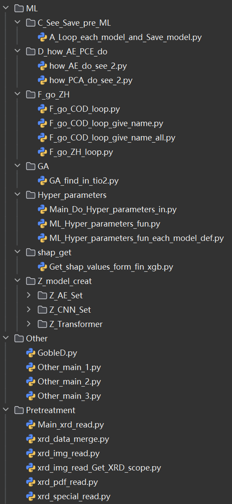

## 1. 前言 / Introduction

随着抗生素在医药和畜牧业中的广泛使用，其残留物频繁进入水体环境，已成为全球范围内关注的重要环境问题。光催化技术因其高效、绿色和可持续的特性，成为降解抗生素等微污染物的理想选择。然而，由于影响光催化降解效率的因素众多（如催化剂类型、光源参数、反应条件及目标污染物结构等），实验方法往往耗时且成本较高，缺乏系统性预测手段。

为此，我们开发了“光催化降解抗生素速率预测平台V1.0”，该平台融合了实验数据、分子描述符、催化剂材料参数（包括XRD数据）以及先进的机器学习（ML）模型，实现对目标体系光催化降解速率常数（log₂k）的预测与解释。本平台不仅为科研人员提供了高效的辅助设计工具，也为光催化材料筛选与实验优化提供了理论依据。

本用户手册旨在帮助用户了解平台的基本功能、操作流程以及模型解释方法，确保用户能顺利、高效地使用本平台进行相关研究工作。

With the widespread use of antibiotics in medicine and animal husbandry, their residues frequently enter the water environment, which has become an important environmental concern worldwide. Photocatalytic technology is ideal for degrading micropollutants such as antibiotics due to its efficient, green and sustainable properties. However, due to the many factors affecting the degradation efficiency of photocatalysis (such as catalyst type, light source parameters, reaction conditions, and target pollutant structure, etc.), experimental methods are often time-consuming and costly, and there is a lack of systematic prediction methods.

To this end, we have developed the "Photocatalytic Degradation Rate Prediction Platform V1.0", which integrates experimental data, molecular descriptors, catalyst material parameters (including XRD data), and advanced machine learning (ML) models to predict and interpret the photocatalytic degradation rate constant (log₂k) of the target system. This platform not only provides researchers with efficient auxiliary design tools, but also provides a theoretical basis for the screening and experimental optimization of photocatalytic materials.

The purpose of this user manual is to help users understand the basic functions, operation process and model interpretation methods of the platform, and ensure that users can use the platform smoothly and efficiently to carry out related research work.

## 2. 功能简介

模型代码的文件树如下所示：

The file tree of the model code is as follows:

`D_how_AE_PCE_do`模块用于对比AE算法和PCA算法对于XRD数据降维的优劣程度。

`F_go_ZH`模块可基于从COD中下载的cif文件生成XRD数据，并对已训练的模型进行降解速率k的预测。

`GA`模块可对使用遗传算法GA，搜索输入的最优解。

`Hyper_parameters`模块基于optuna包进行模型的超参数优化。

`shap_get`模块用于获取模型的shap分析值。

`Z_model_creat`模块中包含了自制的一维CNN、Transformer、和自编码器AE模型，此外，模型训练还可加载RF、XGB和MLP模型进行对比分析。

`Other`模块中包含了其他模块所需要的繁琐方法。

`Pretreatment`模块包含XRD图像的读取和预处理或从pdf卡片中读取XRD数据，XRD、分子指纹和一般降解数据的合并（供ML训练使用）。

The 'D_how_AE_PCE_do' module is used to compare the advantages and disadvantages of the AE algorithm and the PCA algorithm for the dimensionality reduction of XRD data.

The 'F_go_ZH' module generates XRD data based on the CIF file downloaded from the COD and predicts the degradation rate k of the trained model.

The 'GA' module searches for the optimal solution of the input using the genetic algorithm GA.

The 'Hyper_parameters' module optimizes the hyperparameters of the model based on the optuna package.

The 'shap_get' module is used to obtain the shap analysis value of the model.

The 'Z_model_creat' module includes self-made 1D CNN, Transformer, and autoencoder AE models, and model training can also load RF, XGB, and MLP models for comparative analysis.

The 'Other' module contains the cumbersome methods required by other modules.

The 'Pretreatment' module contains the reading and pre-processing of XRD images or the reading of XRD data from pdf cards, the merging of XRD, molecular fingerprints and general degradation data (for ML training).

# 6. Star History

