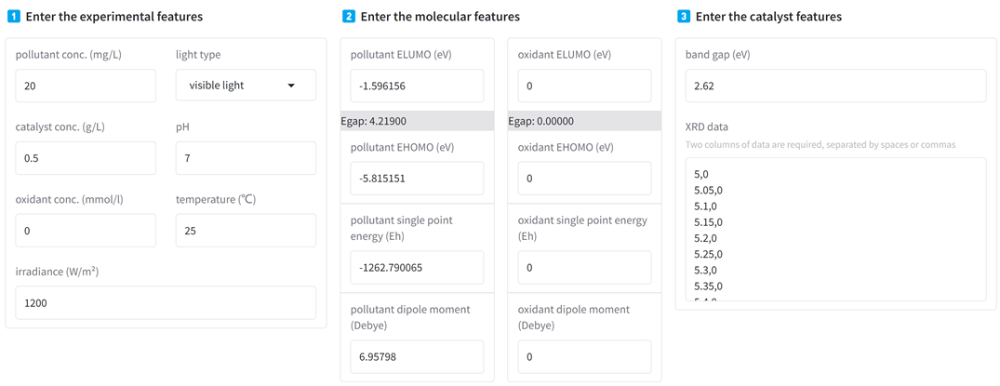
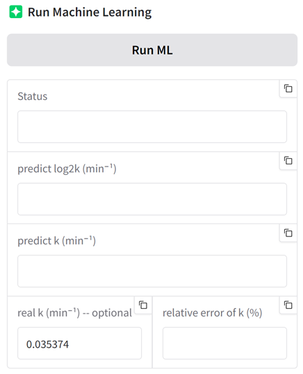
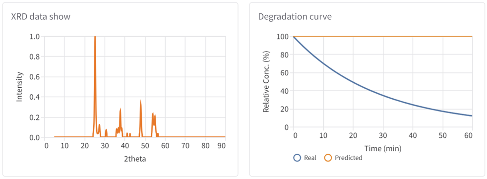

## 1. Model deployment address

[http://xrd.hty.ink](https://xrd.hty.ink)

## 2. Introduction

With the widespread use of antibiotics in medicine and animal husbandry, their residues frequently enter the water environment, which has become an important environmental concern worldwide. Photocatalytic technology is ideal for degrading micropollutants such as antibiotics due to its efficient, green and sustainable properties. However, due to the many factors affecting the degradation efficiency of photocatalysis (such as catalyst type, light source parameters, reaction conditions, and target pollutant structure, etc.), experimental methods are often time-consuming and costly, and there is a lack of systematic prediction methods.

To this end, we have developed the "Photocatalytic Degradation Rate Prediction Platform", which integrates experimental data, molecular descriptors, catalyst material parameters (including XRD data), and advanced machine learning (ML) models to predict and interpret the photocatalytic degradation rate constant (log₂k) of the target system. This platform not only provides researchers with efficient auxiliary design tools, but also provides a theoretical basis for the screening and experimental optimization of photocatalytic materials.

The purpose of this user manual is to help users understand the basic functions, operation process and model interpretation methods of the platform, and ensure that users can use the platform smoothly and efficiently to carry out related research work.

## 3. ML code module

The `ML/D_how_AE_PCE_do` module is used to compare the advantages and disadvantages of the AE algorithm and the PCA algorithm for the dimensionality reduction of XRD data.

The `ML/F_go_ZH` module generates XRD data based on the CIF file downloaded from the COD and predicts the degradation rate k of the trained model.

The `ML/GA` module searches for the optimal solution of the input using the genetic algorithm GA.

The `ML/Hyper_parameters` module optimizes the hyperparameters of the model based on the optuna package.

The `ML/shap_get` module is used to obtain the shap analysis value of the model.

The `ML/Z_model_creat` module includes self-made 1D CNN, Transformer, and autoencoder AE models, and model training can also load RF, XGB, and MLP models for comparative analysis.

The `Other` module contains the cumbersome methods required by other modules.

The `Pretreatment` module contains the reading and pre-processing of XRD images or the reading of XRD data from pdf cards, the merging of XRD, molecular fingerprints and general degradation data (for ML training).

## 4. Web UI

The web UI is built on Gradio. In the parameter input window, sub-window 1 asks for experimental characteristics such as light type, light intensity, and pH, sub-window 2 asks for molecular characteristics such as single energy, energy gap, and dipole moment for contaminants or oxidants, and sub-window 3 asks for material characteristics of the catalyst, including bandgap and XRD spectral data. When the concentration of the oxidant is 0, the molecular characteristics of the oxidant should be filled in as 0. XRD data is required based on a CSV-like format that requires two columns of data, separated by spaces or commas.

In the model output window, click the RUN ML button to run the model and get the predicted degradation rate log2k and k. The Status sub-window displays the running status or error messages. The `real k (min⁻¹) -- The optional` window is an optional input to enter the true k value of the experiment, in which case `the relative error of k (%)` automatically calculates the relative error (%) between the predicted value and the true value.

In addition, the Web UI provides an image display window that provides an image of the XRD spectral information and the degradation rate curve.

